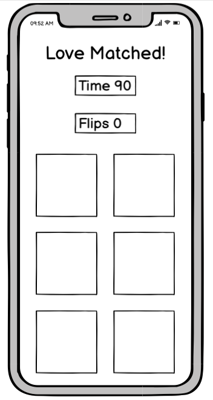
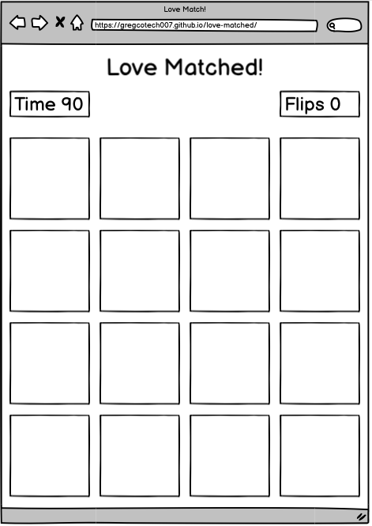

# Love Matched!

[View the Live Project here - Love Matched!](https://gregcotech007.github.io/love-matched/)

The above game website was started as a result of my JavaScript Project. The purpose of the game is to show a level of understanding of a new language such a JavaScript.

## Table of Contents
* [User Stories](#user-story)
* [Design](#design)
* [Features](#features)
* [Languages](#languages)
* [Programs](#programs)
* [Testing](#testing)
* [Deployment](#deployment)
* [Cloning](#cloning)
* [Credits](#credits)
* [Conclusion](#conclusion)

# User Experience (UX)

## User Story

### Intended Audience
The intended audience for this game is to cater for users of all age groups from young to old. Children aged (4+) and adults of all ages.

The purpose of the game is to provide interactive entertainment, test memory skills of what random cards they flipped, in order to match them together. 

The user must complete all the card matches in the allocated time in order to win the game. The purpose of the game is to match all cards with the highest time remaining and with the least amount of card flips.
 
### Realtime User Experience
The user will open up the online game site for "Love Matched" from the link provided. The user will have the ability to play the game on smaller screens such as mobile devices or larger screens such as tablets or desktop computers.

On opening the page, the user is presented with an overlay called "Start Play". When the user clicks on the overlay text, the text disappears and the user is presented with the game area. 

The user is required to click on any random card, which flips over to reveal the back of the card. The card remains flipped until the user selects a second card. 
Once two cards have been flipped, they are checked to see if they are matched to each other, if yes, they remained flipped and if not, they will flip back to display the front of the cards again and allows the user to try again.

Each time the user flips a card, the flips counter increases the counter. 

When the countdown timer reaches zero (0), the user is presented with overlay text that advises "GAME OVER!" and the user is provided the opportunity to play again, if they wish.

If the user completes all matches within the allocated time, the user is presented with overlay text as "WINNER!" and the user is provided the opportunity to play again, if they wish.

### Realtime User Suggestions
To further advance the game, I would suggest adding different challenge levels from easy, medium and difficult. 
The easy level would remain at 90 seconds, while the medium level would have the time reduced by 30 seconds to 60 seconds. The difficult level would be reduced my 50 seconds to 40 seconds.
In addition, the option the add a game player name to store their name and maintain a leader board of results.

# Design
The design of the game consists of a title for the game which is centred at the top of the page. Below that, is the controls area which consists of a countdown timer and also a counter to count the card flips.  

- Wireframes: [Balsamiq](https://balsamiq.com/)
    - Mobile Device Wireframe.

    

    - Desktop Device Wireframe.

    

- Colour Scheme
    - I chose to use colours '#C72B50' (Valentines Red) on the outer webpage and then blending into a lighter colour of '#FFBBC1' (Valentines Pink). I have decided to go with '#C72B50' for the card front and '#FAD007' for the card back.

- Typography
    - The main font used on the website was Google Fonts: Poppins, .

- Font Icons
    - The font icons used from Font Awesome and are loyalty-free.

#  Features
## - Title Area
- Display game title to user with position as centered.
## - Controls Area
- Display a countime timer for the user to complete the win in the allocated time.
- Display a flip counter to increment the amount of times that the cards have been flipped.
- Countdown timer and flip counter are displayed in column view on a mobile device.
- Countdown timer and flip counter are displayed in a row using Flex and 'space-between' view on a tablet or larger device.

## - Game Area
- User is presented 2 columns and 8 rows of cards on a mobile device.
- User is presented 4 columns and 4 rows of cards on a tablet or larger desktop device.

# Technology Used
## - Languages

 

## Programs
- [GitHub](https://github.com/):
    - GitHub was used to backup instances of GitPod Workspaces at intervals.
- [GitPod](https://gitpod.io/):
    - GitPod was used as the main Language Editor for programming the website.
- [JavaScript](https://www.javascript.com/):
    - JavaScipt was used to add function and interactivity to the game website.

# Testing

## Test Cases

### Step One
- On loading the game page, the user is presented with the gamme overlay of "Start Game".
- User selects "Start Game" and the overlay is removed and the user has access to the cards to click on.

### Step Two
- The countdown timer is initiated after the first card is clicked on and starts counting down from 90 seconds.
- The user clicks first card to reveal that icon.
- As this is the first card that the user clicks on, this becomes the current card that the second card will be checked against.

### Step Three
- The user needs to click on a 2nd card to reveal the icon.
- Both cards are then checked against each other for a match. If matched, both cards remain flipped.
- If cards are not matched, then they will flip back to front card and allowed to proceed with the game.

### Step Four
- The user needs match all the card pairs within the allocated countdown time of 90 seconds.
- If all cards are not matched when timer reaches zero, the user is presented with a screen overlay of "Game Over".
- The user has the option of clicking to start a new game.
- If the user starts a new game, the cards, countdown timer and flips counter are reset to default.

### Step Five
- If the user

## Bug Testing
- A delay of 500ms was required after the user clicked to start the game in order to allow the cards to load before they can be clicked.
- When a user flipped their first card, a click restriction was required to prevent them from clicking on the same card again while waiting on another card to check.
- Also, the user should not be allowed to click on a matched card already and prevent it from flipping back and subsequently increasing the flips counter.

## HTML Validation
- [Nu Html Checker](https://validator.w3.org/nu/#textarea):
    - The website was used validate HTML code for any errors.
### HTML Validation Results (Image)

## CSS Validation
- [W3C CSS Validator](https://jigsaw.w3.org/css-validator/validator#css):
    - The website was used validate CSS styling code for any errors.
### CSS Validation Results (Image)

## JS Validation
- [JavaScript Validation](https://jshint.com/):
    - The website was used validate JavaScript code for any errors.
### JS Validation Results (Image)

# Deployment

## GitHub
For deployment of the website to a live publicly accessible website, the following steps were required:
- Confirmed that correct repository is selected as 'love-matched'
- Select 'Settings'
- Scroll down to 'GitHub Pages' and click on 'Check it out here!'
- On the 'Source' section, select Branch as 'main' and click on 'Save'.
- Your site is published at https://gregcotech007.github.io/love-matched/

## Gitpod
For deployment of the website to a local environment, the following steps were required:
- Confirmed that correct repository is selected as 'love-matched'
- To run a new Python server, open a terminal window and type the following code and hit enter:
    - python3 -m http.server
- Once the Python server is running, you will be prompted to open a browser on port 8000 to show the output.

# Cloning
To clone a copy of the code in the repository, the following steps are required:
- Go to https://github.com and select the Repository called 'love-matched'
- Click on the button called 'Code" and a pop-out window will show options to Clone through:
    - HTTPS
    - SSH
    - GitHub CLI
1. On GitHub.com, navigate to the main page of the repository.
2. Above the list of files, click  Code.
3. To clone the repository using HTTPS, under "Clone with HTTPS", click 'Clipboard to copy'. To clone the repository using an SSH key, including a certificate issued by your organization's SSH certificate authority, click Use SSH, then click 'Clipboard to copy'. To clone a repository using GitHub CLI, click Use GitHub CLI, then click 'Clipboard to copy'.
4. Open Terminal.
5. Change the current working directory to the location where you want the cloned directory.
6. Type > git clone and then paste the URL you copied earlier. 
    > $ git clone https://github.com/YOUR-USERNAME/YOUR-REPOSITORY
7. Press Enter to create your local clone.
    > $ git clone https://github.com/YOUR-USERNAME/YOUR-REPOSITORY
    > Cloning into `Spoon-Knife`...
    > remote: Counting objects: 10, done.
    > remote: Compressing objects: 100% (8/8), done.
    > remove: Total 10 (delta 1), reused 10 (delta 1)
    > Unpacking objects: 100% (10/10), done.
8. Repository Clone is now complete.

# Credits

## Tools & Images
- [Google Fonts](https://fonts.google.com/):
    - Google Fonts was imported into the css file to allow use of the following fonts: Open Sans & Poppins.
- [Font Awesome](https://fontawesome.com/):
    - Font Awesome was used to add Font Icons to improve the visual experience for the users.
- [JS logo](https://www.pngitem.com/):
    - JS logo was sourced from the png item website. Copyright-free for personal use.
- [Web Dev Simplified](https://youtube.com/c/WebDevSimplified):
    - Web Dev Simplified offered a great understanding of HTML & CSS.
- [PortEXE](https://youtube.com/c/PortEXE):
    - PortEXE offered a great understanding of JavaScript and explaining its functionality and use.

## Tutorials & Resources
- [GitHub: Clone a Repo](https://docs.github.com/en/repositories/creating-and-managing-repositories/cloning-a-repository)
    - The link includes the full step-by-step instructions from GitHub Support on how to clone a repo.
- [Fisher Yates Shuffle](https://en.wikipedia.org/wiki/Fisher%E2%80%93Yates_shuffle)   
    - The Fisher–Yates shuffle is an algorithm for generating a random permutation of a finite sequence
- [Code Institute](https://codeinstitute.net)
    - The LMS tutorials were beneficial in giving me an insight into starting my first website coding project.
    - Also, I found inspiration from the 'Love Running' project which helped with ideas.
- Code Institute: Mentor: 
    - Thanks to my Mentor who supported me through a project change of idea at short notice..

# Conclusion
To be completed after project coding....

https://gregcotech007.github.io/love-matched/

Greg
